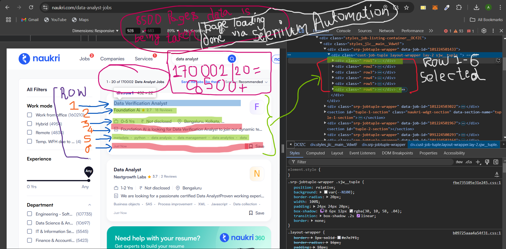
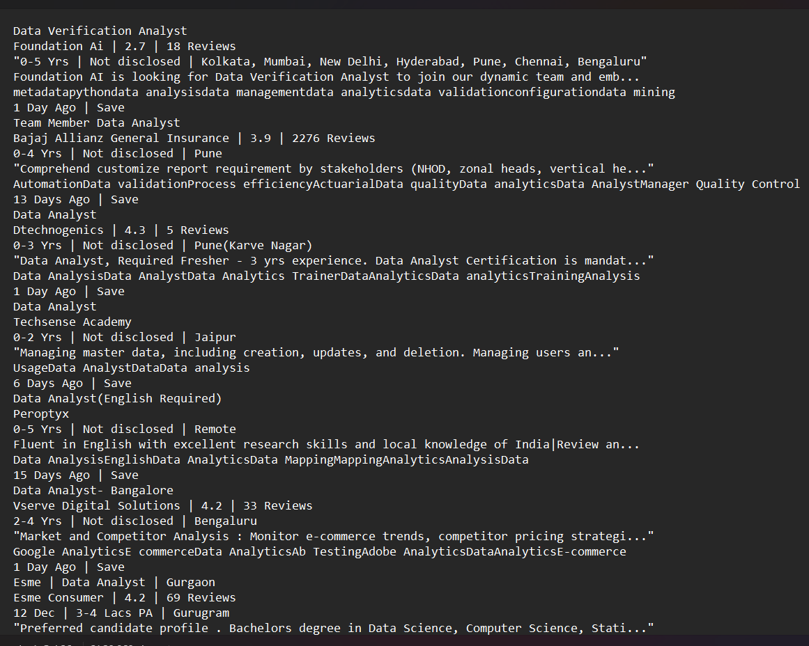
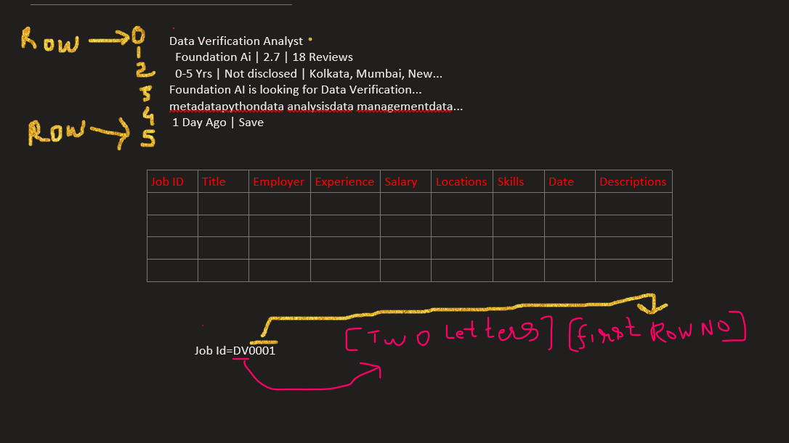

## Naukri.com Portal Data Analyst Job Insights and Statistics

### This project will give the real on the ground job scenario of <b> Data Analyst </b> in Dec 2024, to gather the data from <i> naukri.com</i> automation process by using <b> Selenium </b> and <b> Python </b> is taken into consideration, there is an another method of doing this <i> web scraping </i> i.e by using <b> requests </b> and <b> BeautifulSoup </b> module/library of <b> Python </b> which has previously been used in the project you can check it out here [click](https://www.github.com/ashdude14/DA2).

### Requirements

- VS Code or any IDE.
- Python 3.0.xx installed.
- <b>Make Sure to download the same chrome or any browser webdriver matching with the version. </b>
- Pandas.
- Power BI.

### Phases of Development 

- Gathering the data set - <i> Selenium </i> is being used in <i> Python </i> to generate automation of browser, the core idea behind using this, because <i> Selenium WebDriver</i> works closely with the browser and website can't block the requests.
- Data Cleaning - With the help of <i> Excel </i> and <i> Pandas </i> this Data Cleaning step is being performed to give a well structure of dataset for furthur analysis.
- Data Transformation and Visualization - To get the insights on the various fields with the help of<i> Power BI </i> and <i> DAX queries </i> dashboard and KPIs will be generated. 

### Here is the detail description of <i> Web Scraping </i> via Selenium automation

Let's look out for the desired data.

 

So, after the careful inspection we can get the <i> class </i> names where the data is residing. So total 6 rows are there.
 - row1, row2, row3, row4, row5 and row6.
 - Which can be found with <i>CSS Selector </i>

   ```python
    elements=driver.find_elements(By.CSS_SELECTOR,".row1, .row2,.row3, .row4, .row5, .row6") 
   ``` 
 - Total ```170002``` list data are to be taken and, it can load ```20``` list data in ```1``` page.
 - To load all ```8500``` pages records we need to automate the page by clicking `next` button on <i> bottom-right </i> button ```8500```'s time.

  ```python
   next_button = WebDriverWait(driver, 10).until(
                EC.element_to_be_clickable((By.XPATH, "//span[text()='Next']/.."))
            )

            # Scroll to and click the "Next" button
            driver.execute_script("arguments[0].scrollIntoView(true);", next_button)
            driver.execute_script("arguments[0].click();", next_button)

            # Wait for the next page to load
            time.sleep(5)
  ```

 - These data are exported by using ```csv``` module of ```python``` and that will save the data in ```../DataSet/data.csv``` 

 ```python
 def extract_and_save_data():
    """Extract and save data from the current page."""
    try:
        # Find data elements
        data_elements = driver.find_elements(By.CSS_SELECTOR, ".row1, .row2, .row3, .row4, .row5, .row6")
        save_to_file(Data_Set_path, data_elements)
    except Exception as e:
        print(f"Error during data extraction: {e}")

        def save_to_file(file, elements):
    """Save extracted data to the CSV file."""
    with open(file, 'a', newline='', encoding='utf-8') as f:
        writer = csv.writer(f)
        for element in elements:
            text_content = element.text.strip().split('\n')
            formatted_row = [" | ".join(text_content)]
            writer.writerow(formatted_row)

 ```
 ## Data Cleaning & Transformation

 -  Gathared Data looks like this -
 
 - Idea is to make this data as - 
 
 - Processed data should have 9 columns
   - Job Id
   - Title
   - Employer
   - Experience
   - Salary
   - Locations
   - Skills
   - Date
   - Descriptions
- ```pandas``` is being used for the cleaning and transformations.
### Outcomes of this project
- Various results on the basis of filters can be shown with snapshts will be attached later.
- What are the <b> Key Skills </b> needed to get into the </i> Data Analyst </i> field with <i>Experience </i>?
-
-
-


### How to run this project to your local machine
- Clone this repository in youer local machine
 ```git
 git clone https://www.github.com/ashdude14/DA4
 ```
- Make sure all the required software/module is installed.
- Paste the webdriver in the location
  ```
  CollectData\chromedriver-exe
  ```
- To get the data from Naukri.com portal, run this command 
```
   python collect.py
```
-  Make sure to change the directory to 
```
CollectData>
```
### [Refrences]
 - [chrome web driver version download](https://googlechromelabs.github.io/chrome-for-testing/#stable)

### Challenges
- Uploading large files data
```error

error: RPC failed; HTTP 400 curl 92 HTTP/2 stream 5 was not closed cleanly: CANCEL (err 8)
send-pack: unexpected disconnect while reading sideband packet
fatal: the remote end hung up unexpectedly
```
```cmd
git push
Enumerating objects: 18, done.
Counting objects: 100% (18/18), done.
Delta compression using up to 8 threads
Compressing objects: 100% (11/11), done.
Writing objects: 100% (14/14), 636.57 KiB | 5.89 MiB/s, done.
Total 14 (delta 7), reused 0 (delta 0), pack-reused 0
error: RPC failed; HTTP 400 curl 92 HTTP/2 stream 5 was not closed cleanly: CANCEL (err 8)
send-pack: unexpected disconnect while reading sideband packet
fatal: the remote end hung up unexpectedly
Everything up-to-date
```
- Enabling Large File System to upload ```data.csv```
```git
git lfs install
git lfs track "*.csv"
git add .gitattributes
git add DataSet/data.csv
git commit -m "Added CSV LARGE FILE"
```
```  
#error
batch response: This repository is over its data quota. Account responsible for LFS bandwidth should purchase more data packs to restore access.
error: failed to push some refs to 'github.com:ashdude14/DA4.git'
```
- After adding ```data.csv``` in ```.igignore``` file ```LFS``` works sucessfully!
 ```log
Uploading LFS objects:   0% (0/1), 262 KB | 16 KB/s
 ```
 ```
 LFS: Put "https://github-cloud.s3.amazonaws.com/alambic/media/807411215/9b/7b/9b7b6708a9c6411af5186a98191980dbe183a7557375d236afa9f59cd56020f7?actor_id=81191043&key_id=0&repo_id=899800055": dial tcp: lookup github-cloud.s3.amazonaws.com: no such host
 ```
 ```xml
 <Error>
<Code>AccessDenied</Code>
<Message>Access Denied</Message>
<RequestId>ENTYZSENZCW1DJYX</RequestId>
<HostId>/DJKDiJ8qZsfY1Obj1V6aa2Va+YyuUcCCIldxK9UMfn9LYvmAMUpyEqjiYLDpD8WXUJXanZibwc=</HostId>
</Error>
 ```
 - Increasing the dial time
 ```
 > git config --global lfs.dialtimeout 60
 ```
 - To add ```SSH``` key check
 ```
 cat ~/.ssh/id_ed25519.pub
 ```
 - Add ```Setting```->```SSH```->```New Key```->```paste the key```
##### Contributor & Author 
  - Aashish Kumar Singh [[Email]](ashish.kumar.singh.jee@gmail.com)